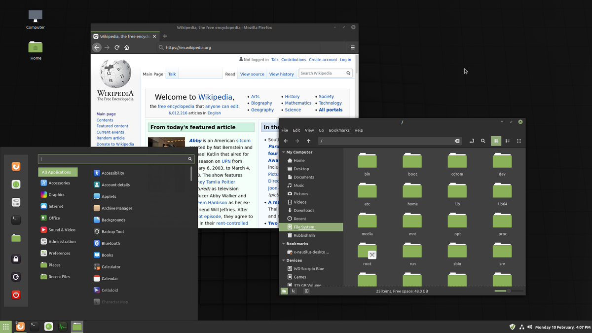
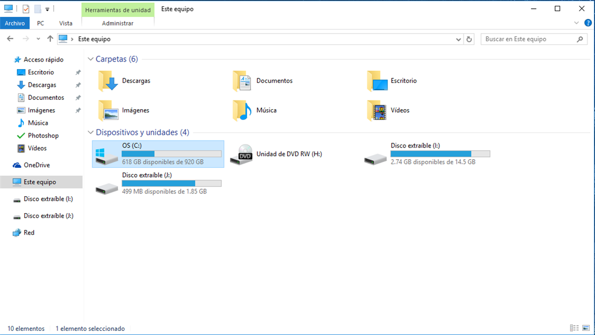
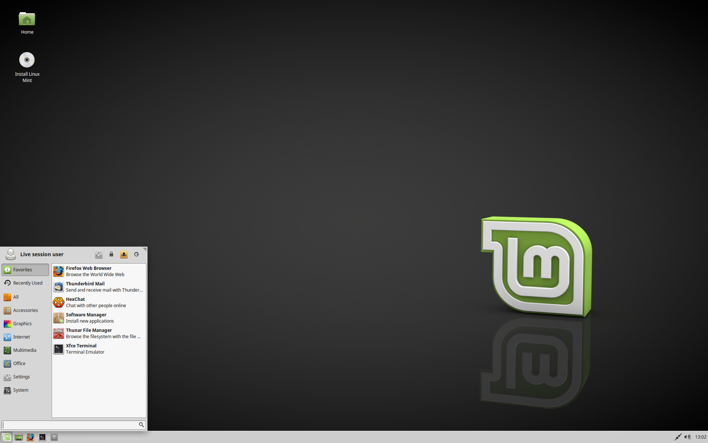
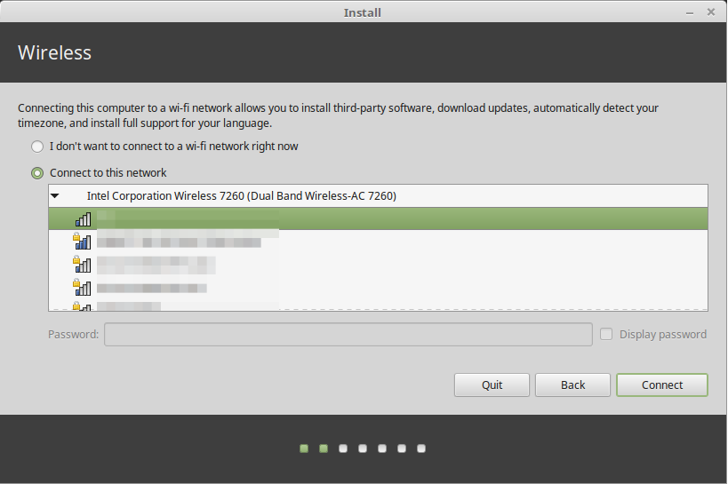
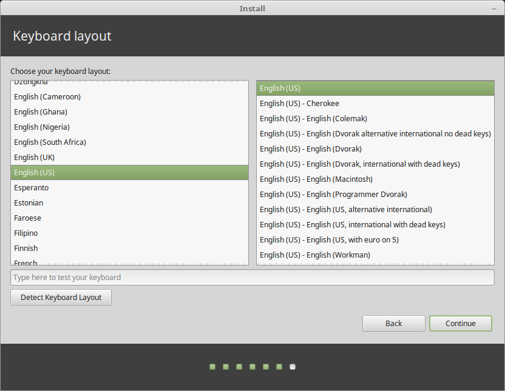
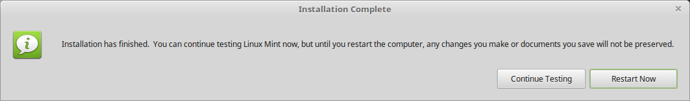

# Introducción a Linux/Unix

## Filosofía de Linux/Unix

En los 80s, Richard Stallman, quien fuera programador del laboratorio de inteligencia artificial del MIT (Massachusetts Institute of Technology), tuvo la idea de desarrollar un sistema operativo libre. Es decir, un SO con kernel, interfaz de usuario y aplicaciones sin licencias restrictivas sobre su uso, copia, distribución y modificación. Es así como nace GNU.

A principio de los 90s, Linus Torvalds que estudiaba en la Universidad de Helsink comenzó a desarrollar un nuevo kernel para construir un sistema operativo más completo. Comenzó utilizando el compilador GNU C Compiler (desarrollado por Richard Stallman) y el sistema operativo MINIX (sistema desarrollado por Andrew S. Tanenbaum). Posteriormente compartió el código fuente de su kernel.

Este sistema, además de utilizar componentes de GNU, compartía la característica de ser un sistema tipo UNIX gratuito y libre. Al ser de caracter público, miles de personas colaboran en el desarrollo del kernel de Linux siendo un proyecto importante *open source*.

Los desarrolladores decidicieron incluir el kernel de Linuz junto con una terminal (shell bash), gestores de ventanas, entornos de escritorio, compilador GCC entre otras aplicaciones de propósito general para dar nacimiento a las llamadas distribuciones de GNU/Linux.

Es importante no confundir Linux con GNU/Linux -aunque hay muchos usuarios que utilizan el término sin distinción. El primero hacer referencia al kernel mientras que el segundo se refiere a los SO con base en el kernel de Linux más aplicaciones GNU.

¿Cuántas versiones de Windows conoces o has utilizado a lo largo de tu vida?

¿Cuántas versiones de MacOS conoces o has utilizado a lo largo de tu vida?

¿Cuántas distribuciones de GNU/Linux conoces o has utilizado a lo largo de tu vida?

¿Cuántas distribuciones de GNU/Linux existen?

### Kernel
Es un programa que conforma el núcleo central del sistema operativo (SO) de una computadora. El kernel -por su nombre en inglés- tiene el control completo sobre todos los sucesos del sistema y se carga en la memoria durante el inicio del sistema para permanecer ahí mientras esté encendida la computadora. Por esta razón, es importante que el kernel sea muy pequeño sin dejar de proporcionar los servicios esenciales que necesitan otros programas.

Debido a su importancia, se carga en un área protegida de la memoria para evitar que otras partes del sistema operativo que se usan con menos frecuencia o los programas de aplicación lo sobrescriban. El kernel realiza tareas, ejecutar procesos y maneja interrupciones,

### Repositorios
Un repositorio es una ubicación de almacenamiento desde la que se recuperan los paquetes de software para su instalación.

Los paquetes en los repositorios oficiales se actualizan constantemente. Esto quiere decir que cuando se actualiza un paquete, su versión anterior se elimina del repositorio.

### Terminal

Es un intérprete de línea de comandos que proporciona una interfaz de usuario tradicional para el sistema operativo Unix y para sistemas tipo Unix. Los usuarios ingresan comandos de texto para que los ejecute el intérprete de línea de comandos o bien, el usuario puede crear scripts de texto de uno o más de dichos comandos.

### Lista de terminales

#### Compatibles con POSIX

* [**Bash**](https://www.gnu.org/software/bash/)
* [Dash](http://gondor.apana.org.au/~herbert/dash/)
* [KornShell](http://www.kornshell.com)
* [Oil Shell](https://www.oilshell.org)
* [Yash](https://yash.osdn.jp)
* [Zsh](https://www.zsh.org/)

#### Alternativas

* [C shell](https://www.tcsh.org)
* [Elvish](https://elv.sh)
* [fish](https://fishshell.com/)
* [ion](https://gitlab.redox-os.org/redox-os/ion/)
* [Nash](https://github.com/NeowayLabs/nash)
* [nushell](https://www.nushell.sh)
* [Oh](https://github.com/michaelmacinnis/oh)
* [PowerShell](https://github.com/PowerShell/PowerShell)
* [rc](http://doc.cat-v.org/plan_9/4th_edition/papers/rc)
* [xonsh](https://xon.sh/)

Para mayor información, puedes consultar el siguiente enlace: https://pubs.opengroup.org/onlinepubs/009695399/utilities/xcu_chap02.html

### Entornos de escritorio
Un entorno de escritorio (DE) es una implementación metafórica de escritorio compuesta de un conjunto de programas que comparten una interfaz gráfica de usuario (GUI) común.

Un DE agrupa una variedad de componentes para proporcionar elementos de interfaz gráfica de usuario comunes. En éstos se incluyen iconos, barras de herramientas, fondos de pantalla y widgets de escritorio.

La mayoría de los DE incluyen aplicaciones y utilidades integradas. Así como su propio administrador de ventanas. No obstante, estos administradores se pueden reemplazar.

Algunos DE que podemos encontrar entre las distribuciones de GNU/Linux son:

* [Budgie](https://blog.buddiesofbudgie.org)
* [**Cinnamon**](https://github.com/linuxmint/Cinnamon)
* [Cutefish](https://cutefish-ubuntu.github.io)
* [Deepin Desktop Environment](https://www.deepin.org/)
* [Enlightenment](https://www.enlightenment.org/)
* [GNOME](https://www.gnome.org/)
* [GNOME Flashback](https://wiki.gnome.org/Projects/GnomeFlashback)
* [KDE Plasma](https://www.kde.org/plasma-desktop)
* [LXDE](https://lxde.org/)
* [LXQt](https://lxqt.github.io/)
* [MATE](https://mate-desktop.org/)
* [Sugar](https://sugarlabs.org/)
* [UKUI](https://www.ukui.org/)
* [Xfce](https://xfce.org/)

### Herramientas para crear GUI

* Qt
 * Kit de herramientas multiplataforma de widgets que utiliza C++ estándar pero hace un uso extensivo de un generador de código especial (llamado Meta Object Compiler, o moc) junto con varias macros para enriquecer el lenguaje.
* **GTK**
 * Kit de herramientas multiplataforma para crear interfaces gráficas de usuario. Ofrece un conjunto completo de widgets y suele ser adecuado para proyectos pequeños hasta conjuntos completos de aplicaciones.

Los DE van ligados con Qt o GTK, por ejemplo:

* KDE $\rightarrow$ Qt
* LXQt $\rightarrow$ Qt
* Gnome $\rightarrow$ GTK
* Xfce $\rightarrow$ GTK
* Cinnamon $\rightarrow$ GTK

En nuestro caso, al trabajar con GNU/Linux Mint, estaremos bajo Cinnamon + GTK

## Sistema de Archivos en Linux/Unix.

Una de las principales diferencias entre GNU/Linux y Microsoft Windows es el sistema de archivos y particiones. Por ejemplo, en Windows para referirnos al disco duro primario utilizamos `C:` y el resto de letras para particiones o unidades extraibles.

El sistema de ficheros que utiliza Windows es NTFS y FAT32.

Linux a diferencia de Windows, utiliza ficheros y similar a UNIX cualquier dispositivo accesible por la computadora es tratado como fichero. Así mismo, utiliza directorios -tratados como ficheros especiales- para acceder a discos extraibles, impresoras u otros periféricos.

Por ejemplo, en Linux, el directorio principal se conoce como `root` y se identifica por el caracter `/`. Dentro de este directorio se organizan los subdirectorios restantes. Por ejemplo, `home` que es el directorio personal que coincide con el nombre de cada usuario.

También tenemos el directorio `bin` que contiene todos los binarios del sistema, `boot`que guarda los ficheros necesarios para que arranque el sistema operativo y finalmente `dev`que hace referencia a los diversos tipos de dispositivos físicos.

Linux nos permite crear particiones y montar algunos ficheros. Por ejemplo `home` en una partición distinta al sistema principal. Para mejorar la eficiencia, Linux hace uso de una partición especial llamada `swap` para mover información entre la memoria y el disco.

Mientras que Windows tiene soporte para particiones NTFS y FAT32, Linux de forma nativa tiene soporte para EXT3, EXT4, FAT32, NTFS, NFS, JFS, HFS y HFS+.

### Tablas de particiones

Hay dos tipos principales de tabla de particiones disponibles. Las secciones Master Boot Record (MBR) y GUID Partition Table (GPT) junto con una discusión sobre cómo elegir entre los dos. Una tercera alternativa menos común es usar un disco sin particiones, que también se analiza.

#### Master Boot Record (MBR)

Son los primeros 512 bytes de un dispositivo de almacenamiento. Contiene el gestor de arranque del sistema operativo y la tabla de particiones del dispositivo de almacenamiento. Es importante en el proceso de arranque en los sistemas BIOS.

En la tabla de particiones MBR (también se le suele llamar tabla de particiones DOS o MS-DOS) existen 3 tipos de particiones:

* Primario
* Extendido
 * Lógico

#### GUID Partition Table

Es un esquema de particiones que forma parte de la especificación de la Interfaz de Firmware Extensible Unificada ( Unified Extensible Firmware Interface-UEFI). Utiliza identificadores únicos globales (GUID), o UUID en el mundo de Linux, para definir particiones y tipos de partición. Está diseñado para tener éxito en el método de esquema de partición Master Boot Record.

Al comienzo de un disco de tabla de particiones GUID, hay un registro de inicio maestro (PMBR) protector para proteger contra el software que no reconoce GPT. Este MBR de protección, al igual que un MBR ordinario, tiene un área de código de arranque que se puede usar para el arranque de BIOS/GPT con cargadores de arranque que lo admitan.

La [Wiki de GNU/Linux](https://wiki.archlinux.org/title/Partitioning) considera lo siguiente:

Algunos puntos a tener en cuenta a la hora de elegir:

* Para realizar un arranque dual con Windows (tanto de 32 bits como de 64 bits) utilizando Legacy BIOS, se requiere el esquema MBR.
* Para el arranque dual de Windows de 64 bits usando el modo UEFI en lugar del BIOS, se requiere el esquema GPT.
* Si se tiene hardware antiguo, especialmente en computadoras portátiles antiguas, considere elegir MBR porque es posible que su BIOS no sea compatible con GPT.
* Si está particionando un disco de más de 2 TiB, debe usar GPT.
* Se recomienda utilizar siempre GPT para el arranque UEFI, ya que algunas implementaciones de UEFI no admiten el arranque en el MBR en modo UEFI.
* Si no se aplica nada de lo anterior, puede elegir entre GPT y MBR.

**Observación.** Dado que GPT es más moderno, se recomienda en este caso.

Algunas ventajas de GPT sobre MBR son:

* Proporciona un GUID de disco único y un GUID de partición único (PARTUUID) para cada partición.
* Proporciona un nombre de partición independiente del sistema de archivos (PARTLABEL).
* Número arbitrario de particiones: depende del espacio asignado para la tabla de particiones. * No se necesitan particiones lógicas y extendidas. La tabla GPT contiene espacio para definir 128 particiones.
* Utiliza LBA de 64 bits para almacenar números de sector; el tamaño máximo de disco direccionable es de 2 ZiB. **Observación.** MBR se limita a direccionar 2 TiB de espacio por unidad.
* Almacena un encabezado de respaldo y una tabla de particiones al final del disco que ayuda en la recuperación en caso de que los principales estén dañados.
* Sumas de verificación CRC32 para detectar errores y corrupción del encabezado y la tabla de particiones.

## Drivers

1. Una vez instalado Linux Mint, podemos verificar los controladores de hardware disponibles.

* Inicio Menú $\rightarrow$ Administración $\rightarrow$ Administrador de controladores.

2. Marque las casillas de verificación correspondientes para seleccionar los controladores disponibles y haga clic en Aplicar cambios.
3. Reinicia la computadora.

## Instalación de GNU/Linux Mint

1. Descargar GNU/Linux Mint del siguiente enlace: https://linuxmint.com/download.php
2. Linux Mint viene en 3 sabores diferentes, cada uno con un entorno de escritorio diferente.
 * **Cinnamon**. El escritorio más moderno, innovador y completo.

 

 * MATE. Un escritorio más tradicional y más rápido.

 

 * Xfce. El escritorio más ligero.

3. 32 o 64 bits.
 Desde la versión 20 en adelante, solo está disponible la versión de 64 bits.

Las imágenes ISO de 32 bits se proporcionan para compatibilidad con computadoras más antiguas. La mayoría de las computadoras pueden ejecutarse en 64 bits.

**Observación.** Si tu computadora fue fabricada después de 2007, es posible que tengas un procesador de 64 bits.

4. Para instalar, es necesario hacer doble click en `Install Linux Mint`
5. Selecciona el lenguaje

6. Conectate a internet

7. Si pudiste conectarte a internet, entonces selecciona la casilla

8. Escoge el tipo de instalación

9. Selecciona tu zona horario

10. Selecciona la distribución de tu teclado

11. Ingresa los detalles de usuario

12. Espera mientras se termina de instalar Linux Mint

13. Reinicia la computadora

## Comandos básicos en bash

## Crear, copiar, mover y archivos y directorios

* `ls` – Lista el directorio
* `ls -l` – Lista los archivos en el directorio actual utilizando formato largo
* `ls -laC` – Lista los archivos en el directorio actual utilizando formato largo y los muestra en columnas
* `ls -F` – Lista los archivos en el directorio actual e indica el tipo de archivo
* `ls -al` – Listado formateado con archivos ocultos

* `cd dir` – Cambia el directorio a dir
* `cd` – Cambia a `home`
* `mkdir dir` – Crea un directorio `dir`
* `pwd` – Muestra el directorio actual

* `rm name` – Eliminar un archivo o directorio llamado `name`
* `rm -r dir` – Elimina el directorio `dir`
* `rm -f file` – Forza a eliminar `file`
* `rm -rf dir` – Forza a eliminar un directorio completo `dir` así como todos sus archivos y subdirectorios (**utilizar con extrema precaución**)

* `cp file1 file2` – Copia `file1` a `file2`
* `cp -r dir1 dir2` – Copia `dir1` a `dir2`; Crea `dir2` si éste no existe
* `cp file /home/dirname – Copia el archivo llamado `file` al directorio `/home/dirname`

* `mv file /home/dirname` – Mueveve el archivo llamado `file` al directorio `/home/dirname`
* `mv file1 file2` – Renombra o mueve el archivo `file1` a `file2`; si `file2` es un directorio existente, mueve `file1` dentro del directorio `file2`

* `ln -s file link` – Crea un enlace simbólico a `file`
* `touch file` – Crea o actualiza `file`
* `cat > file` – Coloca la entrada estándar en el archivo `file`
* `cat file` – Muestra el archivo llamado `file`

* `more file` – Muestra el archivo `file` una página a la vez, cambiando a la siguiente con la barra espaciadora
* `head file` – Salida de las 10 primeras líneas de `file`
* `head -20 file` – Muestra las primeras 20 líneas del archivo `file`
* `tail file` – Salida de las últimas 10 líneas de `file`
* `tail -20 file` – Muestra las últimas 20 líneas del archivo `file`
* `tail -f file` – Muestra el contenido del archivo a medida que crece, comenzando con las últimas 10 líneas

## Empaquetado, compresión y conversión de archivos

* `tar cf file.tar files` – Crea un `tar` llamado `file.tar` que contiene `files`
* `tar xf file.tar` – Extrae los archivos de `file.tar`

* `tar czf file.tar.gz files` – Crea un `tar` con compresión Gzip
* `tar xzf file.tar.gz` – Extrae un `tar` utilizando Gzip

* `tar cjf file.tar.bz2` – Crea un `tar` con compresión Bzip2
* `tar xjf file.tar.bz2` – Extrae un `tar` using Bzip2

* `gzip file`– Comprime `file` y lo renombra en `file.gz`
* `gzip -d file.gz` – Descomprime `file.gz` y lo regresa a `file`

##  Ubicación y tipos de archivos, herramientas de búsqueda

* `grep pattern files` – Buscar patrón en archivos
* `grep -r pattern dir` – Busca recursivamente un patrón en `dir`
* `command | grep pattern` - Busca un patrón en la salida de `command`
* `locate file` – Encuentra todas las instancias de archivo
* `find / -name filename` - Comienza con el directorio raíz, busca el archivo llamado `filename`
* `find / -name "*filename*"` – Comienza con el directorio raíz, busca el archivo que contiene la cadena `filename`
* `locate filename` - Encuentra un archivo llamado `filename` usando el comando de localización. Esto supone que ya ha utilizado el comando `updatedb` (ver siguiente)
* `updatedb` - Crea o actualiza la base de datos de archivos en todos los sistemas de archivos adjuntos al directorio raíz de Linux
* `which filename` - Muestra el subdirectorio que contiene el archivo ejecutable llamado `filename`
* `grep TextStringToFind /dir` - Comienza con el directorio llamado `dir`, busca y enumera todos los archivos que contienen `TextStringToFind`

## Información del sistema

* `date` – Muestra la fecha y hora actual
* `cal` – Mostrar el calendario de este mes
* `uptime` – Muestra el tiempo de actividad actual
* `w` – Muestra quién está en línea
* `whoami` – Quién está conectado como
* `finger user` – Muestra información sobre el usuario
* `uname -a` – Muestra información del kernel
* `cat /proc/cpuinfo` – Información del CPU
* `cat /proc/meminfo` – Información de la memoria
* `df -h` – Muestra el uso del disco
* `du` – Mostrar el uso del espacio del directorio
* `free` – Mostrar uso de memoria y `swap`

##  Documentación interna del Sistema Operativo

* `apropos subject` – Lista de páginas de manual por tema
* `man -k keyword` – Mostrar páginas de manual que contengan `keyword`
* `man command` – Muestra el manual para `command`
* `man -t man | ps2pdf` - > man.pdf  – Crea un pdf de una página del manual
* `which command` – Muestra el nombre de la ruta completa de `command`
* `time command` – Ver cuánto tiempo toma `command

* `whereis app – Muestra una posible localización de `app`
* `which app – Muestra qué aplicación se ejecutará de forma predeterminada. Este muestra la ruta completa

## Red

* `ifconfig` – Lista las direcciones IP para todos los dispositivos en la máquina local
* `iwconfig` – Se utiliza para configurar los parámetros de la interfaz de red que son específicos de la operación inalámbrica (por ejemplo: la frecuencia)
* `iwlist` – se utiliza para mostrar información adicional de una interfaz de red inalámbrica que `iwconfig` no muestra
* `ping host` – Ping host y resultados de salida
* `whois domain` – Obtener información whois para el dominio
* `dig domain` – Obtener información DNS para el dominio
* `dig -x host` – Host de búsqueda inversa
* `wget file` – Descarga un archivo
* `wget -c file` – Continua una descarga detenida

## SSH
* `ssh user@host` – Conecta a `host` como `user`
* `ssh -p port user@host` – Conecta a `host` en el puerto `port` como `user`
* `ssh-copy-id user@host` – Agrega una llave al `host` para `user` para habilitar un inicio de sesión con clave o sin contraseña

## Administración de usuario
* `adduser accountname` – Crea un nuevo usuario llamado `accountname`
* `passwd accountname` – Proporciona a `accountname` una nueva contraseña
* `su` – Inicie sesión como superusuario desde el inicio de sesión actual
* `exit` – Deja de ser superusuario y vuelve a ser usuario normal

## Gestión de procesos
* `ps` – Muestra tus procesos actualmente activos
* `top` – Mostrar todos los procesos en ejecución
* `kill pid` – Matar id de proceso pid
* `killall proc` – Mata todos los procesos llamados `proc` (**use con extrema precaución**)
* `bg` – Lista los trabajos detenidos o en segundo plano; reanudar un trabajo detenido en segundo plano
* `fg` – Trae el trabajo más reciente a primer plano
* `fg n` – Trae el trabajo n al primer plano

##  Comenzando a usar la línea de comandos

[Cubo de comandos de Debian](https://blog.desdelinux.net/wp-content/uploads/2011/10/debian_cubo_comandos.png.webp)

[Cubo de comandos de Ubuntu](https://blog.desdelinux.net/wp-content/uploads/2011/10/ubuntu_cubo_comando.png.webp)

Los permisos en Linux o GNU/Linux son importantes y se pueden hacer desde un entorno gráfico o desde la línea de comandos. Esto permite el acceso a los usuarios en nuestro equipo restringiendo su acceso o modificación. Por ejemplo, para la línea de comandos podemos utilizar el siguiente comando.

`chmod octal file` – Cambie los permisos de archivo a octal, que se pueden encontrar por separado para usuario, grupo y mundo agregando: 4: leer (r), 2: escribir (w), 1: ejecutar (x)

Ejemplos:
* `chmod 777` – Lee, escribe, ejecuta para todos
* `chmod 755` – `rwx` para propietario, `rx` para grupo y mundo

Para más opciones, consulta `man chmod`.

##  Permisos y propietarios de un archivo

* `owner` - Usuario que creó y que tiene un archivo o directorio.
* `group` - Todos los usuarios que son miembros del mismo grupo.
* `others` - Resto de los usuarios del sistema que no son `owner` ni miembros de `group`.

Cuando queremos saber qué permisos tiene un archivo en particular y a qué usuario le pertenece, podemos utilizar el siguiente comando:

~~~
 ls -l nombre_archivo
~~~

### Tipos de archivo

| Tipo de archivo | Significado      |
|:---------------:|:----------------:|
| d               | Directorio       |
| l               | Enlace simbólico |
| s               | Socket           |
| p               | Pipe             |

### Permisos numéricos

| Binario | Decimal | Permisos | Descripción                    |
|:-------:|:-------:|:--------:|:------------------------------:|
| 000     | 0       | `---`    | Ningún permiso                 |
| 001     | 1       | `--x`    | Ejecución                      |
| 010     | 2       | `-w-`    | Escritura                      |
| 011     | 3       | `-wx`    | Escritura y ejecución          |
| 100     | 4       | `r--`    | Lectura                        |
| 101     | 5       | `r-x`    | Lectura y ejecución            |
| 110     | 6       | `rw-`    | Lectura y escritura            |
| 111     | 7       | `rwx`    | Lectura, escritura y ejecución |

### Ejemplo
~~~
 $ ls -l file.dat
 -rwxr–-rw- 1 belphegor belphegor 114399 Dec 11 12:59 file.dat
~~~

* `-rwxr-rw-` – Representa los permisos del archivo y se encuentra dividido en cuatro grupos: (`–`), (`rwx`), (`r--`) y (`rw-`).
 * El primer grupo indica el tipo de archivo. Si `file` fuera un directorio, se cambiaria el guión por la letra `d`.
 * Los tres caracteres siguientes representan los permisos del propietario. Para este caso el propietario `belphegor` puede leer (`r`), escribir (`w`) y ejecutar (`x`) el archivo `file.dat`.
 * Los siguientes tres son los permisos del grupo. Aquí observamos que el grupo `belphegor` tiene permisos de lectura (`r`), pero no de escritura (`w`) y ejecución (`x`). Esto debido a que aparece un guión en lugar de la respectiva letra.
 * El último grupo representa los permisos de los usuarios restantes. Aquí observamos que sólo tiene permisos de lectura y escritura pero no de ejecución.
* `1` – Representa la cantidad de enlaces fijos (hard links). Se le conoce como enlace fijo al nombre adicional para un archivo existente.
* `belphegor belphegor` – Propietario y grupo propietario del archivo `file.dat`.
* `114399` – Tamaño del archivo en bytes.
* `Dec 11 12:59` – Fecha de la última modificación.
* `file.dat` – Nombre del archivo o carpeta.

### Atributos de archivos

#### Cambia el propietario del archivo

Para cambiar el propietario de un archivo o de una carpeta, podemos utilizar el comando `chown`

~~~
 chown [propietario/grupo] [nombre_archivo]
~~~

#### Ejemplo 1

Poner a `user` como propietario actual del archivo `file.dat`

~~~
 chown user file.dat
~~~

#### Ejemplo 2

El archivo `file.dat` pertenece al grupo `group`

~~~
 chown :group file.dat
~~~

#### Ejemplo 3

Cambiar el grupo y propietar al mismo tiempo del archivo `file.dat`

~~~
 chown user:group file.dat
~~~

Para cambiar el grupo al cual pertenece un archivo o directorio, podemos utilizar el comando `chgrp`

~~~
 chgrp grupo [nombre_archivo/nombre_carpeta]
~~~

#### Ejemplo 1

~~~
 chgrp group file.dat
~~~

#### Ejemplo 2

~~~
 chgrp -R group nombre_carpeta
~~~

## Programación Shell.
## Control y monitoreo de Procesos.
## Comandos Avanzados en bash.
## Programación Shell avanzada.
